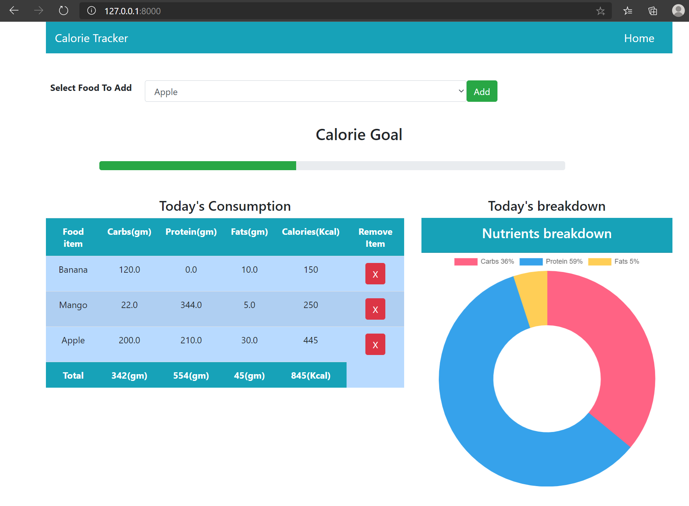

# django-calorie-tracker
Digital healthcare solutions are a necessity in today’s world, starting from water trackers, calorie trackers to pedometers. So, why not build a simple calorie tracker as a part of my python Django projects compilation!

The intention here is to create a web app using Djnago that tracks calories intake and track the calories consumptions. 

This web app tracks calorie intakes based on the user’s inputs. The app can display the breakdown of the nutrients for the day along with the calorie goals.

# Technology stack:
- Django
- Python 
- BootStrap
- HTML
- Javascript
- CSS
- Docker

# Demo:

